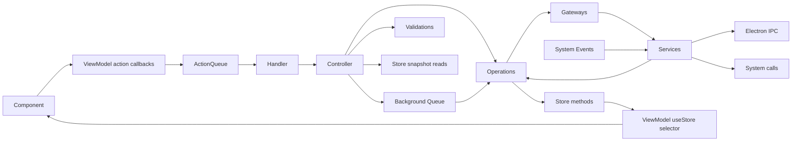

# App architecture (Vayeate Theme Studio)

Scope: [`vayeate-theme-studio/`](vayeate-theme-studio/).

## Layers

| Layer | Role |
|-------|------|
| `electron/` | Main process, preload, IPC — no business logic |
| `src/app/` | UI, actions, handlers, controllers, viewmodels |
| `src/domain/` | Operations, validations, zustand stores, utils |
| `src/gateway/` | Services + gateway facades over external systems |
| `src/model/` | Domain types; **zod** for validation |

## Feature and concept folders

- Under `src/app/<ui-domain>/`, keep feature-level action unions, guards, and handlers for broad UI-domain actions. Complex components may own `components/<component>/actions/`, `components/<component>/controllers/`, and `components/<component>/use-*-viewmodel.ts`. Feature action unions include component action unions, feature guards delegate to component guards, and feature handlers may delegate to component-local handlers before routing their own switch cases to controllers.
- Prefer domain-first organization under `src/domain/<business-domain>/` and `src/domain/ui/<ui-domain-or-flow>/`, with each domain owning its `operations/`, `validations/`, `state/`, and helpers. Legacy shared concept folders under `src/domain/operations`, `src/domain/validations`, and `src/domain/state` remain valid only for shared or not-yet-migrated concerns.

## Mutation flow

- Only **UI-originated signals** on the action queue - pointer/keyboard events, and React **lifecycle** moments where a screen or control **mounts or unmounts** (e.g. `*_ON_LOAD`, `*_ON_UNLOAD`, `*_ON_OPEN`). React components call named callbacks returned by their viewmodel; viewmodels own action construction and dispatch. Components may keep DOM/UI logic such as event extraction, propagation handling, and UI casting, but not business mutations. Feature handlers may delegate to component-local handlers after an action guard; leaf handlers call controllers, one per action type.
- **State updates only in operations.** Controllers and validations may read store snapshots; never set state.
- **Business logic only in operations.** Gateways/services: system + conversion, not business domain rules.
- **Controllers** must not call other controllers; only validations and operations ([controller.mdc](controller.mdc)).
- **Exception — action queue status and App shell:**
  - Operations to update state that reflects the action queue’s own status (depth, processing flag, etc.) may be invoked from inside the `ActionQueue` implementation (`src/app/core/actions/`), not via handler → controller → operation. **Rationale:** routing that update through a normal app action would require enqueueing an action to mutate queue state, which **cycles** through the queue. This is an intentional exception.
  - App shell load and unload controllers should be invoked directly from `useEffect` calls in the **app shell viewmodel** hook used exclusively by that shell (e.g. `useAppShellViewModel` in `src/app/app/viewmodel/`). **Rationale:** these handlers handle initial app setup and cleanup that may occur before the action queue is ready or after it is cleaned up; colocating lifecycle in the shell’s viewmodel keeps mount/unload next to shell-only selectors without spreading `useEffect` across arbitrary components.
  - `InitializeWindowCallbacksOperation` may inject controller classes **only** to adapt renderer window/global-input callbacks into existing controller entry points when calling `WindowService.init(...)`. **Rationale:** these callbacks originate from Electron/window system events rather than from a React component interaction, and the operation acts as the one-time registration boundary for that system integration. This exception does **not** allow general controller-to-controller orchestration or arbitrary controller injection into other operations.

## Store conventions

- Store classes live under `src/domain/**/state/`; use `src/domain/state/<domain>/` for shared legacy state, `src/domain/<business-domain>/state/` for business-domain state, and `src/domain/ui/<flow>/state/` for UI-domain state.
- Name files in **kebab-case** with a `-store.ts` suffix and export one `@singleton()` class.
- Build stores with `createStore(...)` from `zustand/vanilla` and `immer(...)` from `zustand/middleware/immer`.
- Expose `api` for React subscriptions and `getStore()` for domain-layer reads and writes.
- Viewmodels subscribe with `useStore(store.api, selector)`; components should not subscribe directly.
- Controllers and validations read store snapshots; operations perform writes through store methods.

## Actions

- Shape: `<CONTROL>_<ACTION>` (e.g. `CATALOG_PAGE_ON_LOAD`).
- One action per **user or lifecycle** interaction; one type per component/event (reuse only for same control type with a discriminant field).
- **Lifecycle:** Page, panel, window, and dialog **load** and **unload** are valid action sources — enqueue the same way as click handlers (e.g. `useEffect` cleanup for unload). Treat them as **UI-originated**, not back doors around the queue.
- Payload: only user input or entity identifiers — **not** values derivable from app state.

## DI and files

- **tsyringe** **`@singleton()`** for controllers, operations, validations, gateways, services — inject **concrete types** directly; **no** string or symbol injection tokens.
- **One** top-level export per file.
- **React components** under `src/app/**` (all `*.tsx` in the app layer): **PascalCase** filename matching the exported component function name (see [component.mdc](component.mdc)).
- **All other** source modules (controllers, operations, viewmodels, state, gateways, services, models, handlers, etc.): **kebab-case** filename matching export; exported **classes** **PascalCase** where applicable.

**Convention tests (keep in sync):** [`vayeate-theme-studio/test/architecture/architecture.test.ts`](vayeate-theme-studio/test/architecture/architecture.test.ts). **When you change these bullets or exceptions, update the matching `describe` and vice versa.** The file should continue to encode mutation-flow checks (no operation-to-operation `execute`, no controller-to-controller `run`), handler import boundaries, action payload imports (no `domain/state`), and Electron versus renderer `src/` imports — see the table at the top of that test file.

The operation-to-operation `execute` check should allow the narrow background-work bridge: operations may call `EnqueueBackgroundActionOperation.execute(...)` only to enqueue asynchronous background work, not to orchestrate peer domain operations. If that class is reclassified as a queue service/adapter, update this exception and the test language together.

## Good / bad

| Good | Bad |
|------|-----|
| `CloseWindowController` | `HandleSaveButtonClickController` |
| Operation owns state write after validation in controller | Handler contains business rules |
| ViewModel exposes selectors | Component defines `useStore(...)` inline |