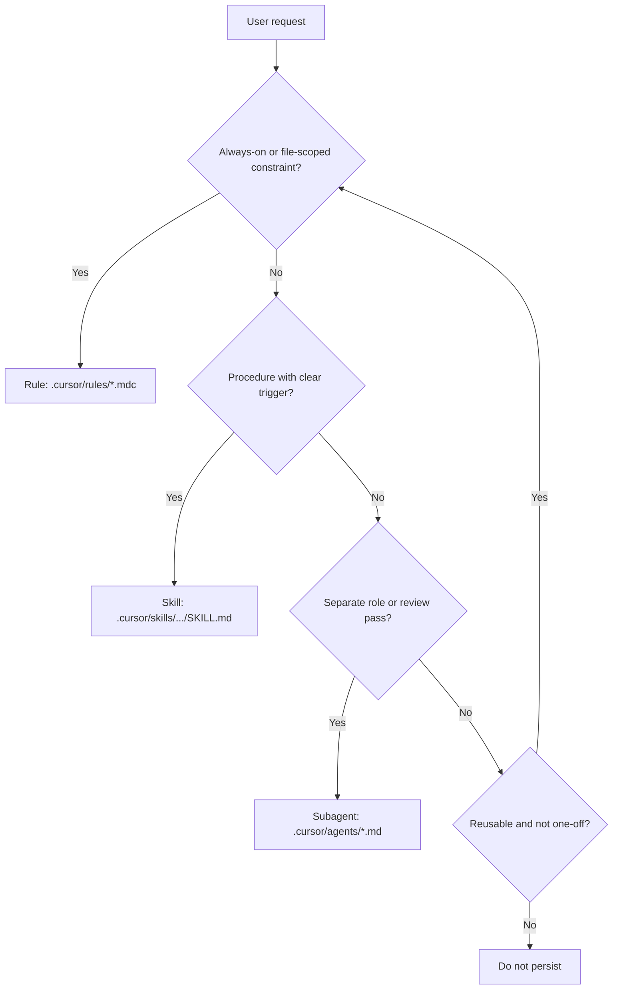

# Update Agent Instructions

Use this skill when:
- the user explicitly describes what the agent should do or know and how that should be used (e.g. "always run tests after changing X", "when doing Y, follow steps A then B", "review Z before merging")
- the user asks to add or change "agent instructions", "rules", "skills", or "how the agent behaves" with specific content (not just "update from session")

This skill is **user-intent-driven**. For session- or delta-driven updates (refactors, corrections, touched directive files), use the **maintain-directives** skill instead.

## Inputs from the user

Capture:

- **What** the instructions should say: constraints, steps, conventions, triggers.
- **How** they should be used: always-on vs contextual, file-specific vs global, one-off procedure vs reusable workflow, who does it (main agent vs dedicated subagent).

If the request is vague, ask for scope, trigger scenarios, or examples before choosing rule vs skill vs subagent.

## Decision flow: rule vs skill vs subagent

### Put it in a rule when:
- it is a durable constraint or project-wide expectation
- it should apply automatically (always or when certain files/globs are in context)
- Use `.cursor/rules/*.mdc` with frontmatter (`description`, `globs` or `alwaysApply`). See create-rule skill for format.

### Put it in a skill when:
- it is a repeatable procedure or task-specific workflow
- it should load only when relevant (procedure with steps, optional templates/scripts)
- Use `.cursor/skills/<name>/SKILL.md`. See create-skill for structure and description (WHAT + WHEN, third person).

### Put it in a subagent when:
- the task needs an isolated role with a focused objective
- the workflow benefits from a fresh context or dedicated review pass (e.g. directive-maintainer)
- Use a single `.md` under `.cursor/agents/` with name, description, and required output format. See `.cursor/agents/directive-maintainer.md` for structure.

### Update existing when:
- an existing directive already fully covers it
- Prefer updating one existing directive over adding overlapping ones.

## Procedure

1. **Capture** the user's request: what the instructions should be and how they should be used; resolve ambiguity with questions if needed.

2. **Evaluate existing**: Search and read:
   - `.cursor/rules/**`
   - `.cursor/agents/**`
   - `.cursor/skills/**`
   - `AGENTS.md`
   When the user's request concerns repo-wide routing or Copilot workflows, also read `.github/agents/*.md` and `.github/skills/*.md` per AGENTS.md. Find instructions that match or overlap the request.

3. **Decide** for each piece of the request: update existing (which file) vs create new (rule vs skill vs subagent) vs do not persist, using the decision flow above.

4. **Report first** (unless the user asked for direct edits): Write a short plan to `state/directive-update-report.md` when proposing multiple file changes; otherwise give the plan in-chat. Include: recommended updates, exact files, rationale, and what not to change.

5. **Apply**: Create or update rules, skills, or subagents per the plan. For new artifacts, follow create-rule / create-skill conventions; for subagents, follow the structure of `.cursor/agents/directive-maintainer.md`. Update AGENTS.md (e.g. skills index, "which file to read first") only when the new/updated directive should be in the routing table.

## Output format

- **Recommended durable updates**: file path, change, reason.
- **Updates explicitly not recommended**: and why.
- **Suggested patch plan**: ordered steps.
- If no durable changes are justified, say so clearly.
