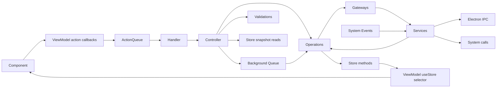

# App architecture (Vayeate Theme Studio)

Scope: [`vayeate-theme-studio/`](vayeate-theme-studio/).

## Layers

| Layer | Role |
|-------|------|
| `electron/` | Main process, preload, IPC — no business logic |
| `src/app/` | UI, actions, handlers, controllers, viewmodels |
| `src/domain/` | Operations, validations, zustand stores, utils |
| `src/gateway/` | Services + gateway facades over external systems |
| `src/model/` | Domain types; **zod** for validation |

## Feature and concept folders

- Under `src/app/<ui-domain>/`, keep feature-level action unions, guards, and handlers for broad UI-domain actions. Complex components may own `components/<component>/actions/`, `components/<component>/controllers/`, and `components/<component>/use-*-viewmodel.ts`. Feature action unions include component action unions, feature guards delegate to component guards, and feature handlers may delegate to component-local handlers before routing their own switch cases to controllers.
- Prefer domain-first organization under `src/domain/<business-domain>/` and `src/domain/ui/<ui-domain-or-flow>/`, with each domain owning its `operations/`, `validations/`, `state/`, and helpers. Legacy shared concept folders under `src/domain/operations`, `src/domain/validations`, and `src/domain/state` remain valid only for shared or not-yet-migrated concerns.

## Mutation flow



- Only **UI-originated signals** on the action queue - pointer/keyboard events, and React **lifecycle** moments where a screen or control **mounts or unmounts** (e.g. `*_ON_LOAD`, `*_ON_UNLOAD`, `*_ON_OPEN`). React components call named callbacks returned by their viewmodel; viewmodels own action construction and dispatch. Components may keep DOM/UI logic such as event extraction, propagation handling, and UI casting, but not business mutations. Feature handlers may delegate to component-local handlers after an action guard; leaf handlers call controllers, one per action type.
- **State updates only in operations.** Controllers and validations may read store snapshots; never set state.
- **Business logic only in operations.** Gateways/services: system + conversion, not business domain rules.
- **Controllers** must not call other controllers; only validations and operations ([controller.mdc](controller.mdc)).
- **Exception — action queue status and App shell:**
  - Operations to update state that reflects the action queue’s own status (depth, processing flag, etc.) may be invoked from inside the `ActionQueue` implementation (`src/app/core/actions/`), not via handler → controller → operation. **Rationale:** routing that update through a normal app action would require enqueueing an action to mutate queue state, which **cycles** through the queue. This is an intentional exception.
  - App shell load and unload controllers should be invoked directly from `useEffect` calls in the **app shell viewmodel** hook used exclusively by that shell (e.g. `useAppShellViewModel` in `src/app/app/viewmodel/`). **Rationale:** these handlers handle initial app setup and cleanup that may occur before the action queue is ready or after it is cleaned up; colocating lifecycle in the shell’s viewmodel keeps mount/unload next to shell-only selectors without spreading `useEffect` across arbitrary components.
  - `InitializeWindowCallbacksOperation` may inject controller classes **only** to adapt renderer window/global-input callbacks into existing controller entry points when calling `WindowService.init(...)`. **Rationale:** these callbacks originate from Electron/window system events rather than from a React component interaction, and the operation acts as the one-time registration boundary for that system integration. This exception does **not** allow general controller-to-controller orchestration or arbitrary controller injection into other operations.

## Store conventions

- Store classes live under `src/domain/**/state/`; use `src/domain/state/<domain>/` for shared legacy state, `src/domain/<business-domain>/state/` for business-domain state, and `src/domain/ui/<flow>/state/` for UI-domain state.
- Name files in **kebab-case** with a `-store.ts` suffix and export one `@singleton()` class.
- Build stores with `createStore(...)` from `zustand/vanilla` and `immer(...)` from `zustand/middleware/immer`.
- Expose `api` for React subscriptions and `getStore()` for domain-layer reads and writes.
- Viewmodels subscribe with `useStore(store.api, selector)`; components should not subscribe directly.
- Controllers and validations read store snapshots; operations perform writes through store methods.

## Actions

- Shape: `<CONTROL>_<ACTION>` (e.g. `CATALOG_PAGE_ON_LOAD`).
- One action per **user or lifecycle** interaction; one type per component/event (reuse only for same control type with a discriminant field).
- **Lifecycle:** Page, panel, window, and dialog **load** and **unload** are valid action sources — enqueue the same way as click handlers (e.g. `useEffect` cleanup for unload). Treat them as **UI-originated**, not back doors around the queue.
- Payload: only user input or entity identifiers — **not** values derivable from app state.

## DI and files

- **tsyringe** **`@singleton()`** for controllers, operations, validations, gateways, services — inject **concrete types** directly; **no** string or symbol injection tokens.
- **One** top-level export per file.
- **React components** under `src/app/**` (all `*.tsx` in the app layer): **PascalCase** filename matching the exported component function name (see [component.mdc](component.mdc)).
- **All other** source modules (controllers, operations, viewmodels, state, gateways, services, models, handlers, etc.): **kebab-case** filename matching export; exported **classes** **PascalCase** where applicable.

**Convention tests (keep in sync):** [`vayeate-theme-studio/test/architecture/architecture.test.ts`](vayeate-theme-studio/test/architecture/architecture.test.ts). **When you change these bullets or exceptions, update the matching `describe` and vice versa.** The file should continue to encode mutation-flow checks (no operation-to-operation `execute`, no controller-to-controller `run`), handler import boundaries, action payload imports (no `domain/state`), and Electron versus renderer `src/` imports — see the table at the top of that test file.

The operation-to-operation `execute` check should allow the narrow background-work bridge: operations may call `EnqueueBackgroundActionOperation.execute(...)` only to enqueue asynchronous background work, not to orchestrate peer domain operations. If that class is reclassified as a queue service/adapter, update this exception and the test language together.

## Good / bad

| Good | Bad |
|------|-----|
| `CloseWindowController` | `HandleSaveButtonClickController` |
| Operation owns state write after validation in controller | Handler contains business rules |
| ViewModel exposes selectors | Component defines `useStore(...)` inline |

> **Apply only when:** Use when authoring, modifing, or interacting with react components

# Component

## Contract

- **PascalCase** functional components; **one** exported component function per file; **PascalCase** filename stem matching the exported component name (e.g. `ThemeDetailsCard.tsx` exports `ThemeDetailsCard`).
- Each event prop references a **named function** (`onClick={onMenuThemeToggleClick}`), not an inline arrow on the JSX element.
- **User and lifecycle** events (clicks, inputs, **mount load**, **cleanup unload**) → call a named callback returned by the viewmodel; no direct controller/operation calls from handlers.
- Components do not call `useAppDispatch()` for component interactions; viewmodels expose named action callbacks and own action construction/dispatch.
- Read state through **viewmodels** only. Component files may contain UI/DOM logic needed to render and wire controls. Business-facing presentation logic, derived guards, validation messages, and action dispatch callbacks belong in the viewmodel.

**Convention tests (keep in sync):** [`vayeate-theme-studio/test/architecture/architecture.test.ts`](vayeate-theme-studio/test/architecture/architecture.test.ts). **When you change filename or export rules above, update those `describe` blocks and vice versa.**

## Anti-patterns

- `useStore(...)` subscriptions or other direct store reads inside component files (use viewmodel).
- Payloads that duplicate state (pass only user input + ids).

## Good / bad

```tsx
// BAD — resolves controller inline
onClick={() => void container.resolve(SaveController).run()}

// BAD — inline handler on event prop
onClick={() => dispatch({ type: 'THEME_SAVE_BUTTON_ON_CLICK' })}

// GOOD — named handler calls viewmodel callback
function onThemeSaveButtonClick() {
  viewModel.onThemeSaveButtonClick();
}
// ...
onClick={onThemeSaveButtonClick}
```

> **Apply only when:** Use when authoring, modifing, or interacting with controllers

# Controller

## Contract

**Convention tests (keep in sync):** [`vayeate-theme-studio/test/architecture/architecture.test.ts`](vayeate-theme-studio/test/architecture/architecture.test.ts). **When you change class/file naming here, update `*-controller.ts: one exported class…` and vice versa.** AST checks also enforce **no `this.<OtherController>.run`** under `src/app/**` (`describe('app *-controller.ts: controllers do not call other controllers .run')`).

- Suffix **`Controller`**; **one** public method **`run`** returning **`void`** or **`Promise<…>`** as needed (per action or use case).
- **Inject** concrete classes via **tsyringe** **`@singleton()`** — no string or symbol tokens.
- **Read** state through injected store snapshots such as `this.catalogsStore.getStore().state`; **never** mutate state here.
- Compose **validations** then **operations**. For command failures they may throw; for UI validation they may use `Validator<T>`/`ValidationResult` and call an operation that writes error-message state.
- **Must not** call another controller’s `run` (or resolve another `*Controller`). A controller may sequence multiple operations for one UI use case after validation, provided it does not mutate state directly or embed business algorithms. Put reusable domain algorithms in operations; keep UI-outcome orchestration in controllers.

## Naming

- App domain action oriented, **no UI event names**.

| Good | Bad |
|------|-----|
| `DeleteCurrentCatalogController` | `HandleSaveButtonClickController` |
| `CloseWindowController` | `OnTextInputChangeController` |

## Anti-patterns

- Business rules beyond orchestration (belongs in **operations**).
- Calling gateways/services directly (use **operations**).
- Chaining controllers (`this.otherController.run(...)`) — use operations or separate actions instead.

> **Apply only when:** Use when authoring, modifing, or interacting with gateways

# Gateway (concept)

**Convention tests (keep in sync):** [`vayeate-theme-studio/test/architecture/architecture.test.ts`](vayeate-theme-studio/test/architecture/architecture.test.ts). **When you change gateway class/file naming here, update that `describe` and vice versa.**

## Role

- Facade over **services**: convert **wire/raw** data ↔ **domain models** (e.g. JSON → zod parse).
- **No** business logic; system-edge concerns (shape, defaults, errors from I/O) only.

## DI

- **`@singleton()`**; inject concrete **services** and other infra — no string or symbol tokens; not React.

## Callers

- **Operations** (preferred). Not handlers or components.

## Good / bad

| Good | Bad |
|------|-----|
| `parseCatalogJson(raw: unknown): Catalog` | Reject save because "duplicate name" |
| Thin wrapper over `FileService` + zod | Controller calls gateway directly for writes |

> **Apply only when:** Use when authoring, modifing, or interacting with Ui types - actions, handlers, components, viewmodels

# Layer: app

## Structure per domain

- Feature-root `actions/` — action types + **handlers** for broad UI-domain actions. Feature action unions may include component action unions, feature guards may delegate to component guards, and feature handlers may delegate to component-local handlers after an action guard. Leaf handlers route to controllers only.

  **Convention tests (keep in sync):** [`vayeate-theme-studio/test/architecture/architecture.test.ts`](vayeate-theme-studio/test/architecture/architecture.test.ts). **When handler module naming or export shape changes here, update `*-handler.ts: one exported class…` and vice versa.** Tests also forbid imports from `domain/operations`, `domain/validations`, and `domain/state` in `actions/*-handler.ts`; require **one exported function** in `actions/*-action-guard.ts`; and forbid `domain/state` imports in `actions/*-action-type.ts` (payload hygiene).

- `components/` — React UI; **PascalCase** `*.tsx` filenames per [component.mdc](component.mdc). Self-contained component flows may colocate `actions/`, `controllers/`, and `use-*-viewmodel.ts` under `components/<component>/`.
- `controllers/` — app-facing orchestration entrypoints; run validations then operations only, and do not call other controllers. Component-owned controllers may live under `components/**/controllers/`.
- `viewmodel/` or colocated `components/**/use-*-viewmodel.ts` — exposes store state via `useStore(store.api, selector)`, derived presentation state, and named action callbacks; uses validations for guards.

  **Convention tests (keep in sync):** [`vayeate-theme-studio/test/architecture/architecture.test.ts`](vayeate-theme-studio/test/architecture/architecture.test.ts). **When viewmodel file/hook naming changes here or in [viewmodel.mdc](viewmodel.mdc), update that `describe` and vice versa.**

## Actions

- Naming: `<CONTROL>_<ACTION>` (e.g. `THEME_DETAILS_SAVE_BUTTON_ON_CLICK`).
- **One** action per **user or lifecycle** interaction (clicks, inputs, **mount load**, **unmount/cleanup unload**, etc.); only UI-derived or identity fields in payload (not state-derived).
- **Handlers**: contain no business logic. Feature handlers may delegate to component-local handlers after an action guard, and leaf handlers route to controllers only.

## Good / bad

```ts
// BAD — handler mutates or implements rules
case X: setState(...); break;

// GOOD
case X:
  await container.resolve(FooController).run(action);
  break;
```

> **Apply only when:** Use when authoring, modifing, or interacting with Domain types - operations, validations, state, utils

# Layer: domain

## Top-level domain structure

- `src/domain/` is organized by domain first. Business-domain folders such as `catalog/` own business state and validations. UI-domain folders under `ui/<flow>/` own renderer-facing UI state and operations. Each domain may contain its own `operations/`, `validations/`, `state/`, and helpers. Legacy shared concept folders such as `operations/`, `validations/`, `state/`, `utils/`, and `core/` remain valid for shared or not-yet-migrated concerns. App-facing controller orchestration lives under `src/app/**/controllers/`.
- Controllers under `src/app/**/controllers/` run validations then operations only (**must not** invoke other controllers); **never** set store state directly

  **Convention tests (keep in sync):** [`vayeate-theme-studio/test/architecture/architecture.test.ts`](vayeate-theme-studio/test/architecture/architecture.test.ts). **When you change controller class/file naming here, update that `describe` and vice versa.**

- `operations/` — **only** place for business logic, gateways/services, and **store writes** (**exception:** queue-status slice updates invoked **only** from `ActionQueue` in app core — see [app-architecture.mdc](app-architecture.mdc))
- `validations/` — `Validate*` classes with `test(...)` returning either `boolean` for simple predicates or `ValidationResult` for UI/error-message workflows. Use `Validator<T>` to compose multiple message-bearing validations.
- `state/` — zustand store classes plus state shape/helpers
- `utils/` — pure helpers (no state mutation)
- `core/` — shared domain-layer primitives and infrastructure helpers that support multiple domain concepts without introducing renderer or Electron business logic

## Invariants

- Controllers and validations **read** store snapshots; **operations** apply updates via store methods.
- No domain business rules in `electron/` or raw React components.

## Good / bad

```ts
// BAD — controller patches state
this.catalogsStore.getStore().setCatalog(next);

// GOOD — controller calls operation that uses store method
this.saveCatalogOp.execute({ id, data });
```

> **Apply only when:** Use when authoring, modifing, or interacting with Electron files

# Layer: electron

## Rules

**Convention tests (keep in sync):** [`vayeate-theme-studio/test/architecture/architecture.test.ts`](vayeate-theme-studio/test/architecture/architecture.test.ts) — `describe('electron/*.ts: no imports from renderer src/')` ensures Electron sources do not import the renderer `src/` tree.

- **No business logic.** `electron/` may contain OS/Electron APIs, window lifecycle code, IPC wiring, preload surface definition, and Electron-only support helpers such as path/bootstrap or log-forwarding modules.
- **All renderer IPC** from the app goes through a **service**; that service is reached via **gateway** or **operation** (not ad-hoc `ipcRenderer` scattered in domain).

## Good / bad

```ts
// BAD — domain rules in main
if (catalog.isDirty) { /* ... */ }

// GOOD — main forwards invoke/handle; validation in renderer domain
ipcMain.handle('read-file', (_, path) => fs.promises.readFile(path, 'utf8'));
```

> **Apply only when:** Use when authoring, modifing, or interacting with Gateway types - services and gateways

# Layer: gateway

**Convention tests (keep in sync):** [`vayeate-theme-studio/test/architecture/architecture.test.ts`](vayeate-theme-studio/test/architecture/architecture.test.ts). **When layer-wide gateway/service file conventions change, update those `describe` blocks and the dedicated rule files, and vice versa.**

## Services

- Talk to **outside systems**: filesystem, IPC bridge, shell, native APIs.
- **No** domain/business rules; system-oriented error handling is OK.

## Gateways

- **Abstractions** over services: parse/serialize, map JSON ↔ model types.
- **No** business logic; conversion and I/O orchestration at the edge only.

## Callers

- **Operations** invoke gateways/services (not components/handlers).
- **`@singleton()`** on gateway/service classes; inject **concrete types** — no string or symbol tokens.

## Good / bad

```ts
// BAD — gateway decides "is catalog valid for publish"
if (catalog.tokens.length < 5) throw ...

// GOOD — gateway reads/writes bytes or IPC; operation decides validity
const raw = await this.fileService.read(path);
return CatalogGateway.parse(raw);
```

> **Apply only when:** Use when authoring, modifing, or interacting with Domain models

# Model

## Rules

- Domain shapes and parsers live in **`src/model/`**.
- Use **zod** for runtime validation and inferred TypeScript types.
- Keep models **free** of React, DI, and I/O (no `fs`, no `ipc`).

## Files

- Keep one cohesive model family per file; **kebab-case** filename aligned with the family. Schema modules may export the related zod schemas, inferred types, constants, and helpers for that model family.

**Convention tests (keep in sync):** [`vayeate-theme-studio/test/architecture/architecture.test.ts`](vayeate-theme-studio/test/architecture/architecture.test.ts). **When kebab-case or exclusion rules change there or here, update that `describe` and vice versa.**

## Good / bad

```ts
// GOOD
export const CatalogSchema = z.object({ id: z.string(), ... });
export type Catalog = z.infer<typeof CatalogSchema>;

// BAD — model imports electron ipc
import { ipcRenderer } from 'electron';
```

> **Apply only when:** Use when authoring, modifing, or interacting with Operations

# Operation

## Contract

**Convention tests (keep in sync):** [`vayeate-theme-studio/test/architecture/architecture.test.ts`](vayeate-theme-studio/test/architecture/architecture.test.ts). **When you change class/file naming here, update `*-operation.ts: one exported class…` and vice versa.** AST checks also enforce **no `this.<OtherOperation>.execute`** under `src/domain/**` (`describe('domain *-operation.ts: operations do not call other operations .execute')`).

- Suffix **`Operation`**; **one** method **`execute(...)`** with explicit inputs.
- **tsyringe** **`@singleton()`**; inject gateways, services, and store classes as **concrete types** — no string or symbol tokens.
- May call **gateways** and **services**; **must not** call another operation.
- **Exception:** `InitializeWindowCallbacksOperation` may inject controller classes solely to register `WindowService.init(...)` callbacks for renderer window/global-input events. Keep this exception narrow: registration only, no additional orchestration logic, and no copying this pattern to other operations without updating the architecture rules.
- **Exception:** operations may inject and call `EnqueueBackgroundActionOperation` only to enqueue asynchronous background work; it must not be used for domain-operation orchestration.
- Prefer **inputs from controller** over reading store state inside `execute` when practical (keep reusable).

## Scope

- **One** logical atomic change; one primary entity (batch OK when inherently single action, e.g. token set).

## Callers

- **Controllers** only (not handlers, components, or other operations). Each controller **must not** call another controller — same “no chaining peers” idea as operations ([controller.mdc](controller.mdc)).
- **Exceptions:** `InitializeWindowCallbacksOperation` is allowed to bridge system callbacks to controller entry points as described above. `EnqueueBackgroundActionOperation` is allowed as the narrow background queue bridge described above.

## Good / bad

| Good | Bad |
|------|-----|
| `DeleteCatalogOperation.execute({ catalogId })` | Operation calls `otherOp.execute` |
| Operation uses store method after gateway load | Controller writes store state |

> **Apply only when:** Use when authoring, modifing, or interacting with Services

# Service

**Convention tests (keep in sync):** [`vayeate-theme-studio/test/architecture/architecture.test.ts`](vayeate-theme-studio/test/architecture/architecture.test.ts). **When you change service class/file naming here, update that `describe` and vice versa.**

## Role

- **System integration**: file APIs, **IPC** to main, windows, timers, etc.
- **No** domain rules; translate platform errors to typed results where helpful.

## Placement

- Lives under **`src/gateway/services/`** (or equivalent `services` subtree).

## Callers

- **Gateways** or **operations** (per architecture); keep components free of IPC.

## DI

- **`@singleton()`**; inject **concrete types** only — no string or symbol tokens.

## Good / bad

```ts
// GOOD
async readText(path: string): Promise<string> { ... }

// BAD — business validation
async readText(path: string) {
  if (!path.endsWith('.json')) throw ...
}
```

> **Apply only when:** Use when authoring, modifing, or interacting with zustand stores

# State

## Store shape

- State lives in domain-owned **zustand vanilla stores** under `src/domain/**/state/**`, including shared legacy state under `src/domain/state/**`, business-domain state under `src/domain/<business-domain>/state/**`, and UI-domain state under `src/domain/ui/**/state/**`.
- Use `createStore(...)` with **`immer(...)`** middleware.
- Each store exposes:
  - One data root such as `state` or `config`
  - Store-owned mutation methods like `setSelectedRef`, `setConfig`, `setMenuOpenState`
  - `api` getter for React subscriptions
  - `getStore()` returning the current store snapshot plus mutation methods

## Access

| Consumer | Read | Write |
|----------|------|-------|
| Controllers / validations | `this.someStore.getStore().state` (or sibling data root like `config`) | Never |
| Operations | `this.someStore.getStore().state` (or sibling data root like `config`) | `this.someStore.getStore().setX(...)` |
| React | Via viewmodel hooks + `useStore(store.api, selector)` | Never |

## Rules

- Stores are **domain-owned** and should stay free of React imports.
- A `*-store.ts` may export pure helper/selectors colocated with the store when they operate on that store's state shape and do not mutate state or import React.
- Keep mutation methods on the store class; components never import or call store mutation methods directly.
- Controllers and validations may read store snapshots, but only operations mutate domain state.
- Prefer narrow store methods over ad-hoc whole-object replacement unless a full snapshot reset is the intended behavior.
- **Do not** update queue-status or queue-observability store state from components, handlers, controllers, or normal operations — only from the queue implementation.

## Good / bad

```ts
// BAD — component subscribes directly and mutates state
const catalog = catalogsStore.getStore().state.catalog;
catalogsStore.getStore().setCatalog(next);

// GOOD — viewmodel + operation boundaries
const catalog = useStore(catalogsStore.api, (store) => store.state.catalog);
this.catalogsStore.getStore().setCatalog(nextCatalog);
```

> **Apply only when:** Use when authoring, modifing, or interacting with Validations

# Validation

## Contract

**Convention tests (keep in sync):** [`vayeate-theme-studio/test/architecture/architecture.test.ts`](vayeate-theme-studio/test/architecture/architecture.test.ts). **When you change validation class/file naming here, update that `describe` and vice versa.**

- Name: **`Validate` + question** (e.g. `ValidateCanLockTemplate`).
- Class-based: **tsyringe** **`@singleton()`**; inject concrete getters/state as needed — no string or symbol tokens.
- **One** function **`test(...)`** returning either **`boolean`** for simple predicates or **`ValidationResult`** for UI-facing validation that needs an error message.
- **Never throw.** Controllers decide whether to throw on failure.
- **Do not** call other validations. `Validator<T>` is the allowed composition helper for sequencing multiple validations and returning the first failure; individual `Validate*` classes should still stay focused and not call peers directly.

## Usage

- **Controllers** run before operations when needed.
- **ViewModels** reuse the same validators for UI enable/disable and messaging.

## Good / bad

```ts
// BAD
test() { if (!x) throw new Error(); }

// GOOD
test(): boolean { return this.getter().foo != null; }

// GOOD — message-bearing UI validation
test(input: string): ValidationResult {
  return input.trim() === ''
    ? { isValid: false, errorMessage: 'Name is required.' }
    : VALIDATION_RESULT_OK;
}
```

> **Apply only when:** Use when authoring, modifing, or interacting with react components ViewModels

# ViewModel

## Contract

**Convention tests (keep in sync):** [`vayeate-theme-studio/test/architecture/architecture.test.ts`](vayeate-theme-studio/test/architecture/architecture.test.ts). **When viewmodel hook/file naming changes here, update `use-*-viewmodel.ts: at least one exported function…` and vice versa.** Components should keep subscriptions inside viewmodels rather than inline in `*.tsx`.

- Expose selected store values via **`useStore(store.api, selector)`**, derived presentation/business guards, error/message state, and named action callbacks.
- Viewmodels may use `useAppDispatch()` to enqueue UI actions.
- **Components must not** define raw store subscriptions inline; they consume viewmodel hooks only.
- Use **validations** for disabled states, tooltips, and guard logic aligned with controllers.

## Anti-patterns

- Store mutation, gateways/services, system I/O, or reusable domain algorithms (belongs in **operations** / **gateways**).
- Direct state mutation.

## Good / bad

```tsx
// BAD — in component file
const x = useStore(catalogsStore.api, (store) => store.state.catalog);

// GOOD — in viewmodel hook
export function useCatalogVm() {
  return useStore(catalogsStore.api, (store) => store.state.catalog);
}
```