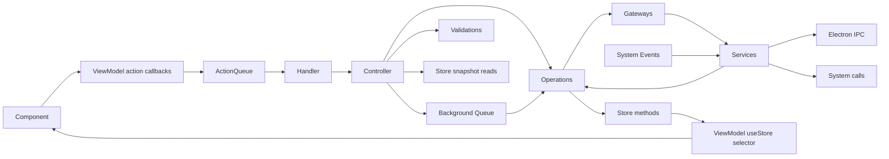

<!-- SPECKIT START -->
For additional context about technologies to be used, project structure,
shell commands, and other important information, read the current plan:
`specs/004-add-undo-functionality/plan.md`
<!-- SPECKIT END -->

# Vayeate Theme Studio App architecture

## Layers

| Layer | Role |
|-------|------|
| `electron/` | Main process, preload, IPC — no business logic |
| `src/app/` | UI, actions, handlers, controllers, viewmodels |
| `src/domain/` | Operations, validations, zustand stores, utils |
| `src/gateway/` | Services + gateway facades over external systems |
| `src/model/` | Domain types; **zod** for validation |

## Feature and concept folders

- `src/app/` is organized by architectural role first, then domain: `actions/`, `components/`, `controllers/`, `viewmodel/`, and `core/`, each divided into `Common/`, `Catalog/`, `Template/`, `Theme/`, `Queue/`, and `Undo/` (for example `src/app/components/Catalog/catalog-page/` and `src/app/core/Queue/action-queue/`). Feature action unions include local action unions, feature guards delegate to local guards, and feature handlers may delegate to local handlers before routing their own switch cases to controllers.
- `src/domain/` is organized by architectural role first, then domain: `operations/`, `validations/`, `state/`, `utils/`, and `core/`, each divided into `Common/`, `Catalog/`, `Template/`, `Theme/`, `Queue/`, and `Undo/` (for example `src/domain/operations/Catalog/` and `src/domain/state/Undo/undo-stack/`). Domain-specific undo replay helpers live under `Catalog/`, `Template/`, and `Theme/` (for example `src/domain/operations/Catalog/catalog-undo-operations/`). Do not add new domain-first folders such as `src/domain/<business-domain>/operations/`.
- `src/gateway/` is organized as `gateway/` for gateway facades and conversion helpers, and `services/` for system integration services and worker entries; both buckets are divided into `Common/`, `Catalog/`, `Template/`, `Theme/`, and `Undo/` (for example `src/gateway/gateway/Catalog/`).
- `src/model/` is divided directly into `Common/`, `Catalog/`, `Template/`, `Theme/`, `Queue/`, and `Undo/`.

## Mutation flow

- Only **UI-originated signals** normally enter the action queue - pointer/keyboard events, and React **lifecycle** moments where a screen or control **mounts or unmounts** (e.g. `*_ON_LOAD`, `*_ON_UNLOAD`, `*_ON_OPEN`). React components call named callbacks returned by their viewmodel; viewmodels own action construction and dispatch. Components may keep DOM/UI logic such as event extraction, propagation handling, and UI casting, but not business mutations. Feature handlers may delegate to local handlers after an action guard; leaf handlers call controllers, one per action type.
- **State updates only in operations.** Controllers and validations may read store snapshots; never set state.
- **Business logic only in operations.** Gateways/services: system + conversion, not business domain rules.
- **Controllers** must not call other controllers; only validations and operations ([controller.mdc](controller.mdc)).
- **Exception — queues, follow-up actions, and App shell:**
  - The action and background queue implementations may call their queue-status controllers directly to update queue observability state. **Rationale:** routing those status updates through the queued action pipeline would require enqueueing actions to mutate queue state, which **cycles** through the queues. This exception is scoped to the queue implementations under `src/app/core/Queue/action-queue/` and `src/app/core/Queue/background-queue/`.
  - **Background queue keys:** `main` (serial deferred renderer work), `deferred` (pooled deferred renderer work — not Web Workers), and `data_io` (keyed persistence I/O). Jobs on `deferred` must be I/O-bound or cooperatively yield; genuinely CPU-bound work belongs in Web Workers under `src/gateway/services/Common/*-worker.ts`.
  - Controllers may enqueue a follow-up action only to adapt a completed UI flow into the target component action, currently the eyedropper commit path (`CloseEyedropperOverlayController` via `EnqueueActionQueueOperation`). **Rationale:** the originating UI interaction has completed and the stored commit target determines which component action receives the selected value. Do not use this exception for general controller orchestration.
  - App shell load and unload controllers should be invoked directly from `useEffect` calls in the **app shell viewmodel** hook used exclusively by that shell (e.g. `useAppShellViewModel` in `src/app/viewmodel/Common/app-shell/use-app-shell-viewmodel.ts`). **Rationale:** these handlers handle initial app setup and cleanup that may occur before the action queue is ready or after it is cleaned up; colocating lifecycle in the shell’s viewmodel keeps mount/unload next to shell-only selectors without spreading `useEffect` across arbitrary components.
  - `LoadAppController` may call `InitializeWindowCallbacksController.run()` during shell startup, and `InitializeWindowCallbacksController` may call `HandleKeyboardShortcutController.run(event)` only from the registered global key callback. **Rationale:** these are app-shell/window integration adapter paths that connect one-time startup and Electron/global-input callbacks to existing controller entry points. Do not use this exception for general controller orchestration.
  - `InitializeWindowCallbacksOperation` may inject controller classes **only** to adapt renderer window/global-input callbacks into existing controller entry points when calling `WindowService.init(...)`. **Rationale:** these callbacks originate from Electron/window system events rather than from a React component interaction, and the operation acts as the one-time registration boundary for that system integration. This exception does **not** allow general controller-to-controller orchestration or arbitrary controller injection into other operations.

## Store conventions

- Store classes live under `src/domain/state/{Common,Catalog,Template,Theme,Queue,Undo}/**`.
- Name files in **kebab-case** with a `-store.ts` suffix and export one `@singleton()` class.
- Build stores with `createStore(...)` from `zustand/vanilla` and `immer(...)` from `zustand/middleware/immer`.
- Expose `api` for React subscriptions and `getStore()` for domain-layer reads and writes.
- Viewmodels subscribe with `useStore(store.api, selector)`; components should not subscribe directly.
- Controllers and validations read store snapshots; operations perform writes through store methods.

## Actions

- Shape: `<CONTROL>_<ACTION>` (e.g. `CATALOG_PAGE_ON_LOAD`).
- One action per **user or lifecycle** interaction; one type per component/event (reuse only for same control type with a discriminant field).
- **Lifecycle:** Page, panel, window, and dialog **load** and **unload** are valid action sources — enqueue the same way as click handlers (e.g. `useEffect` cleanup for unload). Treat them as **UI-originated**, not back doors around the queue.
- Payload: only user input or entity identifiers — **not** values derivable from app state, except for the narrow controller-originated follow-up action described above.

## DI and files

- **tsyringe** **`@singleton()`** for controllers, operations, validations, gateways, services — inject **concrete types** directly; **no** string or symbol injection tokens except documented infrastructure interface registrations. Currently `"IActionQueue"` is the only allowed string token for the action queue interface.
- Class modules export one primary class; component files export one component function. Cohesive action-type, viewmodel, model, and store modules may export related types, constants, guards, and pure helpers.
- **React components** under `src/app/**` (all `*.tsx` in the app layer): **PascalCase** filename matching the exported component function name (see [component.mdc](component.mdc)).
- **All other** source modules (controllers, operations, viewmodels, state, gateways, services, models, handlers, etc.): **kebab-case** filename matching the primary export or module concept; exported **classes** **PascalCase** where applicable.

**Convention tests (keep in sync):** [`vayeate-theme-studio/test/architecture/architecture.test.ts`](vayeate-theme-studio/test/architecture/architecture.test.ts). **When you change these bullets or exceptions, update the matching `describe` and vice versa.** The file should continue to encode mutation-flow checks (no disallowed operation-to-operation `execute`, no controller-to-controller `run`), handler import boundaries, action payload imports (no `domain/state`), and Electron versus renderer `src/` imports — see the table at the top of that test file.

The operation-to-operation `execute` check should allow only narrow bridge/helper exceptions: operations may call `EnqueueBackgroundQueueActionOperation.execute(...)` only to enqueue asynchronous background work; theme color-variable operations may call `SetThemeOperation.execute(next)` plus `ApplyThemeStateAndSchedulePersistOperation.execute(next)` as the established theme state/persist helper pair after building a complete next `Theme`; `ApplyThemeStateAndSchedulePersistOperation` may call `ApplyThemeStateOperation.execute(next)` only as its in-memory apply step before scheduling persist (theme selection uses `ApplyThemeStateOperation` alone, without persist); undo apply-state helpers (`ApplyCatalogUndoStateOperation`, `ApplyTemplateUndoStateOperation`, `ApplyThemeUndoStateOperation`) may call their domain persist/selection operations as the shared undo/redo replay path; `ApplyCatalogSourceUrlUndoOperation` may call `ApplyCatalogUndoStateOperation.execute(...)` only as the shared field-level catalog source URL undo replay path; `RestoreThemePaletteAssignUndoOperation` may call `ApplyThemeUndoStateOperation.execute(...)` only as the shared palette-assignment replay path; undo lifecycle helpers (`ApplyCatalogLifecycleUndoOperation`, `ApplyTemplateLifecycleUndoOperation`, `ApplyThemeLifecycleUndoOperation`) may call delete/create/selection operations only as the shared create/delete/version undo replay path; `RecordCatalogUndoOperation`, `RecordTemplateUndoOperation`, and `RecordThemeUndoOperation` may call `RecordUndoEntryOperation` and `BuildUniversalUndoProcessorOperation` only to register completed edits; and undo stack transition operations (`LoadUndoHistoryOperation`, `SetCurrentUndoStackIdOperation`, `UndoOperation`, `RedoOperation`, `HistoryGoToOperation`) may call `BuildUniversalUndoProcessorOperation` only to hydrate processors for replay. These exceptions must not be used for peer domain-operation orchestration. If these classes are reclassified as queue services/adapters or theme helpers, update this exception and the test language together.

Undo entries use action-generated before/after diffs. Renderer availability and
history summaries are read-only projections, and persisted session undo state is
cleared on startup before new history is recorded.

## Good / bad

| Good | Bad |
|------|-----|
| `CloseWindowController` | `HandleSaveButtonClickController` |
| Operation owns state write after validation in controller | Handler contains business rules |
| ViewModel exposes selectors | Component defines `useStore(...)` inline |

