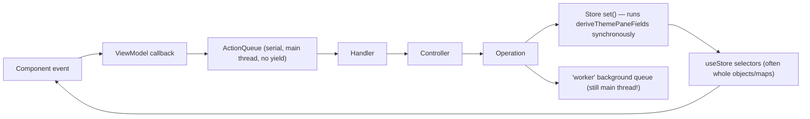

# Vayeate Theme Studio — UI Responsiveness Report

**Date:** 2026-06-17
**Goal:** Eliminate UI stutter while preserving the existing layered architecture
(action queue → handler → controller → operation → store → viewmodel). Where the
architecture itself is the root cause, a single high-level change is proposed
rather than a rewrite.

---

## 1. Executive summary

The architecture is sound and worth keeping. Stutter does **not** come from the
layering itself; it comes from a small number of **synchronous, main-thread work
bursts that run on the one serial action queue and inside synchronous store
writes**, amplified by **broad React subscriptions** and **render-phase
computation**.

There is **one fundamental design gap**: the renderer has a single
`ActionQueue` that processes actions strictly serially on the main thread with
**no frame-yielding and no separation between "interactive" and "heavy" work**.
The `worker` background queue, despite its name, is **not** a Web Worker — it is
a main-thread async pool, so "offloading" to it does not unblock the UI for
CPU-bound work. Only `ClusteringService` uses a real `Worker`.

The single most damaging interaction is **dragging the hue slider** on the Theme
page. One slider tick triggers, synchronously on the main thread:

1. `deriveThemePaneFields` → hue-shift up to ~132 color assignments
   (hex→RGB→HSL→RGB→hex each),
2. `buildScopeColorMap` over ~338 mappings (each possibly a 64-iteration WCAG
   contrast binary search),
3. `JSON.stringify` of all scope-map inputs as a cache key,
4. render-phase re-resolution of all visible editor-preview token lines,
5. a dispatched `RecomputeClusters` action (extra round-trip through the queue).

All of that runs per slider tick, fanning out re-renders to 3+ subscribed cards.

### Priority overview

| Pri | Theme | Representative fix |
|-----|-------|--------------------|
| **P0** | Hot-path synchronous fan-out (hue/cluster drag) | Decouple drag from derivation + cluster recompute; throttle and commit on release |
| **P0** | Heavy work blocks the single action queue | Add a yielding scheduler + an "interactive vs. heavy" lane; chunk/yield long operations |
| **P1** | Render-phase computation in components | Move filter/sort/group into memoized viewmodel selectors |
| **P1** | Broad store subscriptions | Narrow selectors to the selected entity + `useShallow`; split `theme` slice subscriptions |
| **P1** | Undo recording cost on every commit | Cache the universal processor; field-level diffs; drop double `JSON.stringify` equality |
| **P2** | Real off-main-thread compute | Move scope-map/contrast and theme generation into a true Web Worker |
| **P2** | List rendering at scale | Virtualize `TokensCard`/`VariablesCard`; stabilize row callbacks |
| **P2** | Persistence consistency | Route theme persist through `data_io`; lazy/incremental undo-stack serialization |

---

## 2. How the architecture maps to responsiveness



Three structural facts drive every stutter below:

- **F1 — One serial queue, no yielding.** `ActionQueue.process()`
  (`src/app/core/action-queue/action-queue.ts:65`) drains the queue in a
  `while` loop, `await`-ing each action. A slow handler blocks every subsequent
  UI action; there is no `requestAnimationFrame`/`requestIdleCallback`/chunking
  anywhere in the queue. Coalescing exists but only reduces *pending* duplicates;
  it does not reduce per-action cost.
- **F2 — Synchronous derivation inside store writes.** `ThemeUiStore`'s
  `setThemesState` (`src/domain/state/ui/theme-ui-store.ts:45`) runs
  `deriveThemePaneFields` *inside* the immer `set` for every input-changing
  mutation. This is on the main thread, in the action critical path.
- **F3 — "worker" queue is not a worker.** `WorkerBackgroundQueue` /
  `PooledQueue` (`src/app/core/background-queue/pooled-queue.ts`) `await
  item.run()` on the renderer main thread. CPU-bound jobs placed there still
  block painting. Only `clustering-worker.ts` is a real `Worker`.

These are why "keep the architecture" is the right call — the layers are fine,
but the **scheduling and derivation placement** need to change.

---

## 3. Findings and directed changes

Each item below is written so it can be handed to an implementation agent. File
paths are repo-relative to `vayeate-theme-studio/`.

---

### [x] P0-1 — Hue slider drag: decouple derivation, re-renders, and cluster recompute

**Problem.** `HueSliderOnDelta` → `SetThemeHueAdjustmentOperation.execute`
(`src/domain/operations/theme-operations/palette-hue/set-theme-hue-adjustment-operation.ts:18`)
→ `setHueAdjustment` → `deriveThemePaneFields`
(`src/domain/utils/derive-theme-pane-fields.ts:65`). That recomputes
`paneDisplayColorAssignments` (hue-shift over all assignments) and
`paneSelectedColorsDisplay` on every tick. The palette viewmodel then dispatches
`RecomputeClusters` on every change of `paneDisplayColorAssignments`
(`src/app/theme/theme-palette-card/use-theme-palette-card-viewmodel.ts:73`),
adding another queue round-trip and worker post per tick. Subscribers
(`ThemePaletteCard`, `ThemeVariablesCard`, `EditorPreviewsCard`) all re-render.

**Directed changes.**

1. **Throttle the drag at the source.** In
   `use-theme-palette-card-viewmodel.ts`, gate `setHueAdjustment`'s dispatch
   behind a `requestAnimationFrame` coalescer (store latest value in a ref,
   dispatch at most once per frame), mirroring the existing pattern in
   `EyedropperCanvas.tsx:45`. Keep `coalesceLatest` in the queue as the backstop.
2. **Defer clustering until drag end.** Replace the
   `paneDisplayColorAssignments`-driven `RecomputeClusters` effect with an
   explicit recompute on **pointer-up / commit** only. Add a `HueSliderOnCommit`
   action (the `hueDragStartRef` at line 38 shows commit semantics already
   exist) and dispatch `RecomputeClusters` there, not on every delta. During the
   drag, render the previously computed clusters.
3. **Make derivation lazy for preview-only fields.** During an active hue drag,
   `deriveThemePaneFields` should compute only what the palette swatches need.
   Split `deriveThemePaneFields` so `paneDisplayColorAssignments` (cheap-ish) is
   computed eagerly, but the scope-map / preview-affecting recompute is deferred
   (see P0-2 and P2-1).

**Acceptance.** Dragging the hue slider with the Editor Previews card open keeps
the main thread under one long task per frame; clustering fires once on release;
no `RecomputeClusters` dispatch per tick.

---

### [x] P0-2 — The single action queue has no yielding and no interactive lane

**Problem (the fundamental one).** `ActionQueue` is strictly serial and never
yields to paint. Heavy operations (catalog sync, bulk token import, undo replay,
theme generation prep, clustering input building) run in the same lane as
lightweight interactive actions (typing, hover, selection). One heavy action
delays all queued interactions.

**High-level change (keeps the architecture).** Introduce **cooperative
scheduling** into the existing queue rather than replacing it:

1. **Yield between actions.** In `ActionQueue.process()`
   (`src/app/core/action-queue/action-queue.ts:69`), after each processed action
   `await` a frame boundary (a small `scheduler.yield()`-style helper:
   `await new Promise(r => requestAnimationFrame(() => r()))` or
   `MessageChannel`-based macrotask) when the previous action exceeded a budget
   (e.g. measured >8ms). This lets the browser paint between bursts of queued
   actions.
2. **Add an interactive priority lane.** Give `enqueue` an optional priority and
   keep two internal arrays (`interactive`, `normal`). Drain `interactive`
   first. Tag pointer/hover/typing/selection actions as `interactive`. This is
   additive to the existing `IActionQueue` contract and stays within
   `src/app/core/action-queue/`.
3. **Make long operations chunk + yield.** For operations that loop over large
   inputs (e.g. `buildScopeColorMap`, `generateThemePair`, bulk dedupe), process
   in chunks and `await` a yield between chunks so a long op cannot monopolize a
   frame. Provide a shared `yieldEvery(n)` helper under
   `src/domain/core/` and use it from the heavy operations.

**Note on AGENTS.md.** The queue may call its own status controllers directly
(documented exception). Adding priority/yielding stays inside
`src/app/core/action-queue/`, so update the queue's `describe` block in
`test/architecture/architecture.test.ts` only if the public action-source rules
change (they should not).

**Acceptance.** A deliberately slow action (e.g. catalog sync) no longer freezes
typing in an unrelated field; interactive actions visibly preempt queued heavy
work; frame budget instrumentation shows no task >50ms during normal editing.

---

### [x] P0-3 — `worker` background queue does not actually offload CPU work

**Problem.** `WorkerBackgroundQueue` (`src/app/core/background-queue/worker-background-queue.ts`)
extends `PooledQueue`, which runs jobs on the main thread. Theme generation
(`generate-theme-operation.ts`), preview tokenization, and clustering input prep
are placed there but still block paint while their synchronous bodies run.

**Directed change.** Treat the `worker` queue as what it is — *deferred
main-thread work* — and move the genuinely CPU-bound bodies into a **real Web
Worker** (see P2-1). Short-term, ensure anything on the `worker` queue either (a)
is I/O-bound, or (b) chunks + yields (P0-2.3). Rename the queue key/docs to
`deferred` to remove the false "off main thread" expectation, and update
`AGENTS.md` background-queue references plus the architecture test wording if the
key name changes.

**Acceptance.** No synchronous CPU body >16ms runs on the `worker`/`deferred`
queue without yielding; true CPU work runs in a `Worker`.

---

### [x] P1-1 — Move render-phase filter/sort/group into memoized viewmodel selectors

**Problem.** Several components recompute on **every render**, including renders
triggered by unrelated state (dropdown open, hover):

- `MappingsCard.tsx:788` — `filterMappings` + `.sort` + `buildByGroup` +
  `sortedGroupKeys` in the component body; `buildSemanticBlocks` at line 344.
- `VariablesCard.tsx:482` — `filter`+`sort` of color/contrast variables, plus
  `buildByGroup`/`sortedGroupKeys` at line 173.
- `ThemePaletteCard.tsx:133` — `hueSliderGradientFromRefHex` recomputed each
  render.

**Directed changes.**

1. Move the filter/sort/group logic out of `MappingsCard.tsx` and
   `VariablesCard.tsx` into their viewmodels
   (`use-mappings-card-viewmodel.ts`, `use-variables-card-viewmodel.ts`) wrapped
   in `useMemo` keyed on `[items, searchText, selectedColorKeys, selectedContrastKeys]`.
   The mappings viewmodel already memoizes `mappingsByType`/`orphanKeys`; extend
   the same pattern to the filtered/grouped output so the component only maps
   ready-made arrays.
2. Memoize `hueSliderGradientValue` in `ThemePaletteCard` (or its viewmodel)
   keyed on the reference hex.
3. Wrap `semanticVariant` (`use-mappings-card-viewmodel.ts:249`) and the `?? []`
   fallbacks in `use-editor-previews-card-viewmodel.ts:137` and
   `use-variables-card-viewmodel.ts:193` in `useMemo` / module-level constants so
   they do not produce new references each render.

**Acceptance.** Typing in a search field or opening a dropdown does not recompute
filtered/grouped lists; React Profiler shows the card body work flat across
unrelated renders.

---

### [x] P1-2 — Narrow broad store subscriptions

**Problem.** Viewmodels subscribe to whole maps/objects, so unrelated mutations
re-render them:

- `use-tokens-card-viewmodel.ts:87`, `use-mappings-card-viewmodel.ts`,
  `use-variables-card-viewmodel.ts` subscribe to the entire `catalogs` /
  `templates` maps. Editing or loading *any* catalog/template re-renders these
  cards.
- `use-theme-palette-card-viewmodel.ts:23` and
  `use-editor-previews-card-viewmodel.ts` subscribe to the whole `theme` object;
  any field change re-renders.
- `use-status-bar-viewmodel.ts:31` subscribes to whole queue `state`;
  `use-menubar-viewmodel.ts:77` subscribes to the whole `undoMenu`.

**Directed changes.**

1. Add **ref-scoped selectors** so a card subscribes to the *selected* entity,
   not the whole map. Since stores are immer-backed, the selected entity object
   keeps reference identity when other map entries change; select
   `state.catalogs[selectedKey]` (with `useShallow` for derived arrays) instead
   of the full `catalogs` map.
2. Split the `theme` whole-object subscriptions in the palette and editor-preview
   viewmodels into field-level selectors (`theme.colorAssignments`,
   `theme.contrastAssignments`, `theme.templateRef`, etc.) with `useShallow`,
   so unrelated theme field edits don't re-render the previews.
3. Apply `useShallow` to array-returning selectors in the palette and
   editor-preview viewmodels (currently only 3 viewmodels use it).

**Acceptance.** Loading/editing catalog B does not re-render the card showing
catalog A; editing a theme name does not re-render the editor previews.

---

### [x] P1-3 — Reduce undo-recording cost on every committed edit

**Problem.** Every `recordThemeUndo` / `recordCatalogUndo` / `recordTemplateUndo`
runs on the action queue and does synchronous work:

- `BuildUniversalUndoProcessorOperation.execute()`
  (`build-universal-undo-processor-operation.ts:47`) rebuilds the full handler
  list **on every record**.
- `undoValuesEqual` (`undo-values-equal.ts:7`) does **two `JSON.stringify`** for
  equality; with full-entity diffs this serializes whole `Theme`/`Catalog`
  objects.
- `schedulePersist` (`undo-manager-v2.ts:68`) `JSON.stringify`s the entire stack
  (up to 999 frames) on every push.
- Several controllers store **full entity snapshots** in `before`/`after`
  (e.g. `set-contrast-variable-light-value-controller.ts:45`,
  `update-source-url-controller.ts:59`, palette assign), inflating every step.

**Directed changes.**

1. **Cache the universal processor.** Build it once (memoize on the singleton)
   and reuse, since handlers are static; rebuild only if registrations change.
2. **Replace `undoValuesEqual` deep-stringify** with a cheap structural check
   for the common field-level diffs (primitive compare), falling back to a
   bounded comparison; avoid stringifying whole entities.
3. **Prefer field-level diffs** over full-entity snapshots in the snapshot-style
   controllers. Where a full snapshot is genuinely needed, store a minimal patch
   (changed slice) and reconstruct on replay via the existing apply operations.
4. **Serialize the undo stack incrementally / lazily.** Instead of
   `JSON.stringify(getPersistedState())` on every push, serialize only the new
   frame and append, or move serialization into the `data_io` job body (off the
   action path) so the renderer doesn't stringify the full stack inline.

**Acceptance.** Recording an undo entry for a single color change does no
whole-entity serialization; processor is built once per session; action queue
time per committed edit drops measurably.

---

### [x] P2-1 — Move scope-map / contrast resolution into a real Web Worker

**Problem.** `buildScopeColorMap` (`src/domain/utils/scope-resolver.ts:211`) over
~338 mappings, each possibly running `adjustColorToMeetContrast` (≤64 iterations
of WCAG luminance/contrast), runs synchronously on the main thread, plus its
cache key is `JSON.stringify` of all inputs (`scope-resolver.ts:142`). Editor
preview line resolution then runs in `useMemo` during render
(`use-resolved-editor-previews.ts:103`) and the cache is busted on every scope
map version change (every hue tick).

**Directed changes.**

1. Extend the existing worker pattern (mirror `clustering-service.ts` +
   `clustering-worker.ts`) with a **scope/contrast worker** that takes
   `{ mappings, colorAssignments, contrastAssignments, contrastVariables }` and
   returns the resolved `ScopeColorMap` (and optionally resolved preview lines).
   Keep the pure functions in `src/domain/utils/` so they remain testable and
   reusable as the worker body.
2. Replace the `JSON.stringify` cache key with a **version counter** bumped by
   the store on relevant mutations, avoiding stringify on the hot path.
3. With the map produced off-thread, preview line resolution can consume it
   without blocking render; keep the line cache.

**Acceptance.** Hue drag with previews open shows no main-thread task building
the scope map; preview colors update from worker results without dropped frames.

---

### [x] P2-2 — Virtualize remaining long lists and stabilize row callbacks

**Problem.** `TokensCard.tsx:67` and `VariablesCard.tsx` render every row with
`.map()` (no virtualization), unlike mappings/theme-variables/previews which use
`@tanstack/react-virtual`. Memoized rows are also defeated by unstable callbacks:
`toggleColorChecked`/`toggleContrastChecked`
(`use-theme-variables-card-viewmodel.ts:225`) depend on the `checkedColorRefs`
Set, so any checkbox toggle recreates the callbacks and re-renders all rows;
`VariablesCard.tsx:105` and `MappingsCard.tsx:608` create per-row inline handlers.

**Directed changes.**

1. Apply the existing `VirtualizedRowList` pattern to `TokensCard` and
   `VariablesCard` (threshold ≥10 rows, as mappings does).
2. Stabilize toggle callbacks by reading current selection from the store inside
   the dispatch (functional/ref-based) instead of closing over the Set, so the
   callback identity is stable across selection changes.
3. Hoist per-row handlers in `VariablesCard`/semantic `renderItem` to memoized
   row components with stable props.

**Acceptance.** Large catalogs scroll without mounting all rows; toggling one
checkbox re-renders only the affected row.

---

### [ ] P2-3 — Persistence consistency and back-pressure

**Problem.** Theme edits persist via a renderer-timer debounce
(`debounced-theme-persist-gateway.ts:46`) that does Zod + pretty
`JSON.stringify(theme, null, 2)` + IPC on the renderer, bypassing the `data_io`
queue used by catalog/template. Heavy editing can also saturate `data_io` with
full-entity rewrites competing with undo-stack writes.

**Directed changes.**

1. Route theme persistence through the `data_io` background queue (matching
   `SaveCatalogOperation`/`SaveTemplateOperation`) keyed by theme file, so
   serialization happens in the job body off the action path. Keep debounce
   semantics (debounce → enqueue).
2. Consider compact (non-pretty) serialization for autosave writes and pretty
   only on export, to cut stringify cost for large entities.

**Acceptance.** No `JSON.stringify` of a full theme on a renderer timer in the
interactive path; theme/catalog/template persistence share one queue and key
discipline.

---

## 4. Suggested sequencing for an implementation agent

1. **P0-1** (hue/cluster drag decoupling) — highest perceived-jank win, localized
   to the palette viewmodel + one new commit action.
2. **P0-2** (queue yielding + interactive lane) — the fundamental scheduling fix;
   benefits every interaction. Add frame-budget instrumentation first to measure.
3. **P1-1 / P1-2** (memoize render-phase work; narrow subscriptions) — broad
   re-render reductions.
4. **P1-3** (undo recording cost) — removes per-commit serialization spikes.
5. **P2-1** (scope-map worker) — removes the largest remaining main-thread CPU
   burst.
6. **P2-2 / P2-3** (virtualization, persistence) — scale and consistency.

Each step is independently shippable and testable. After P0/P1, re-profile the
hue-drag and bulk-import flows; the remaining P2 items target scale rather than
typical-session jank.

---

## 5. Validation guidance

- Add a lightweight frame-budget probe (log tasks >50ms) around
  `ActionQueue.process` and `deriveThemePaneFields` during development.
- Manual: hue-drag and cluster-drag with Editor Previews open; bulk-import a
  large token JSON; rapid catalog edits; long undo/redo sequences — none should
  drop frames.
- Keep `npm run lint`, architecture/convention tests, and renderer workflow tests
  green; update `AGENTS.md` + `test/architecture/architecture.test.ts` wording
  only for the queue-lane/`worker`-rename changes (P0-2, P0-3).
```

