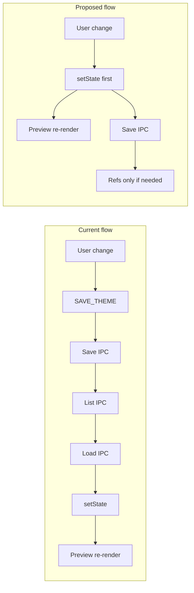

# Theme Page Snappier UI – Ideas and Implementation

## Current behavior (why it feels slow)

- **Preview updates only after persistence.** Changing a variable (color/contrast) dispatches `SAVE_THEME`. The processor runs `saveThemeAndRefresh`, which:
  1. `await themeService.saveTheme(theme)` (IPC → main → write file)
  2. `refreshThemeRefsAndSelect()` → `listThemes()` (IPC) then `loadTheme(name, version)` (IPC again)
  3. Only then `setState({ type: 'SET_THEME', theme: loaded })`
- So the preview recalculates only after **2–3 IPC round-trips** (save, list, load). The theme we “load” is the one we just saved, so we are re-reading from disk unnecessarily.
- **Heavy re-render.** When state finally updates, [EditorPreviewsCard.tsx](vayeate-theme-studio/src/ui/components/EditorPreviewsCard.tsx) recomputes `scopeColorMap` (which can call `adjustColorToMeetContrast` up to 64 iterations per contrast mapping) and then renders every preview block; `PreviewLines` calls `resolveTokenColor` for **every token** on every render with no caching.

---

## Idea 1: Optimistic state update for SAVE_THEME (highest impact)

**What:** Update app state with the new theme **before** (or as soon as) we persist, so the preview re-renders immediately. Persist in the background.

**Implementation:**

- In [AppContext.tsx](vayeate-theme-studio/src/ui/context/AppContext.tsx), in the `SAVE_THEME` case:
  - Call `setState({ type: 'SET_THEME', theme: action.theme })` **first** (synchronous). The preview and variables UI then re-render with the new theme right away.
  - Then `await themeService.saveTheme(action.theme)`.
  - Then refresh only the theme **ref list** (so the sidebar stays correct), without reloading the current theme: e.g. add a helper `refreshThemeRefsOnly(setState)` that does `listThemes()` + `setState({ type: 'SET_THEME_REFS', refs })`. Do **not** call `loadTheme` after save for the same theme/version.
- Optionally: only call `refreshThemeRefsOnly` when the ref list could have changed (e.g. new theme or new version). For in-place variable edits (same name/version), you can skip it to save one IPC.

**Pattern:** Optimistic UI: show the intended state immediately; persistence is async and can be retried or surfaced on failure.

---

## Idea 2: Stop reloading theme after save

**What:** Today `refreshThemeRefsAndSelect` always does `loadTheme(name, version)` after listing. For `SAVE_THEME` we already have the theme in memory; re-loading adds latency and no benefit (we just wrote that file).

**Implementation:**

- Use a “refs-only” refresh after save (as in Idea 1): `listThemes()` + `SET_THEME_REFS` only. Do not call `loadTheme` or `SET_THEME` again after a successful save when the saved theme is the currently selected one.
- Keeps a single source of truth: the theme in state is what was last saved (or last optimistic update). If save fails, you can show an error and optionally revert state from a future “load” or leave the optimistic state and retry save.

---

## Idea 3: Debounce persistence (keep instant preview via optimistic update)

**What:** If the user changes several fields in quick succession (e.g. contrast value + method, or multiple colors), we can persist once after a short idle instead of on every change. The preview must still update on every change.

**Implementation:**

- Keep **instant preview** by applying Idea 1: every variable change still does an immediate state update (e.g. a dedicated `UPDATE_THEME` action that only does `setState(SET_THEME, theme)` with no IPC).
- **Persistence:** debounce the actual `SAVE_THEME` (the one that calls `themeService.saveTheme`). For example:
  - Viewmodel: on variable change, dispatch `UPDATE_THEME` with the new theme (sync state update), and enqueue a debounced “flush” that dispatches `SAVE_THEME` with the current theme from state (or the last theme passed to `UPDATE_THEME`).
  - Or: keep dispatching `SAVE_THEME` from the UI, but in the processor debounce the `saveTheme()` call (e.g. 300–500 ms) and cancel the previous timer when a new `SAVE_THEME` arrives; still apply `setState(SET_THEME, action.theme)` immediately so preview stays instant.
- Ensures one write per burst of edits while preview stays snappy.

---

## Idea 4: Precompute resolved token colors (reduce render cost)

**What:** Today, on every render of `EditorPreviewsCard`, `PreviewLines` calls `resolveTokenColor(scopeColorMap, …)` for every token. That’s O(preview blocks × lines × tokens × scopeColorMap.entries). Do the resolution once when inputs change and render from a precomputed structure.

**Implementation:**

- In [EditorPreviewsCard.tsx](vayeate-theme-studio/src/ui/components/EditorPreviewsCard.tsx), add a `useMemo` that, given `previews` and `scopeColorMap`, builds a structure such as:
  - `resolvedPreviews: { previewId, lines: { lineIdx, tokens: { text, scopes, darkColor, lightColor }[] } }[]`
  - One pass over all tokens, calling `resolveTokenColor` once per token and storing the result.
- Pass `resolvedPreviews` (and `defaultColor` per mode) into `PreviewLines` (or a renamed component). The component then only renders `style={{ color }}` from the precomputed colors—no `resolveTokenColor` during render.
- Effect: resolution work is done once per `scopeColorMap` / preview change instead of on every React render. Especially helpful when many preview blocks or tokens exist.

---

## Idea 5: Memoize preview blocks or lines

**What:** Avoid re-rendering preview blocks that haven’t changed. When only one variable changes, `scopeColorMap` changes and today the whole card re-renders.

**Implementation:**

- Wrap the per-preview block (or `PreviewLines`) in `React.memo`. The catch: `scopeColorMap` is a new object whenever `colorAssignments` / `contrastAssignments` change, so without Idea 4, every block would still re-render.
- **Best combined with Idea 4:** Precompute `resolvedPreviews`; then each block’s props are `resolvedLines` (and maybe `defaultColor`). When only one assignment changes, `resolvedPreviews` is recomputed in one `useMemo`, but you can split so each block receives a slice. If you ever introduce “partial resolution” (e.g. only recompute affected mappings), then memo could skip blocks whose slice didn’t change (would require stable references or custom comparison).
- Simpler standalone win: memoize `PreviewLines` so that if `lines` and the precomputed color array (from Idea 4) are referentially stable for that block, the block doesn’t re-render.

---

## Idea 6: Live preview during color picker drag

**What:** Today, color inputs in [ThemeVariablesCard.tsx](vayeate-theme-studio/src/ui/components/ThemeVariablesCard.tsx) use local state (`pendingDarkPicker`, `pendingLightPicker`, etc.) and only commit on blur. So while dragging the color picker, the right-hand preview does not update.

**Implementation:**

- Introduce a “preview override” that the theme page can pass down: e.g. `pendingColorOverrides: Map<colorRef, { dark?: string, light?: string }>`.
- ThemeVariablesCard already has local state for the picker/hex being edited. Lift that (or expose it via callback) so that the parent (or a small context) has “current editing overrides.” ThemesPage (or the viewmodel) builds a **display theme** = merge(theme, pendingOverrides) and passes that to `EditorPreviewsCard` for rendering only. Persisted theme stays unchanged until blur/commit.
- EditorPreviewsCard would take either the same props it has now (from “display theme”) or an explicit `colorAssignments` / `contrastAssignments` that can be the merged view. So preview updates every frame during drag without any save or action queue.

---

## Idea 7: useDeferredValue for preview theme

**What:** When a single state update causes expensive work (buildScopeColorMap + large PreviewLines tree), we can defer the value used for the preview so React can keep the rest of the UI responsive and then update the preview in a second pass.

**Implementation:**

- In ThemesPage or EditorPreviewsCard, use `const deferredTheme = useDeferredValue(vm.theme)` (or deferred `colorAssignments` / `contrastAssignments`). Pass `deferredTheme` (or its assignments) into EditorPreviewsCard for building `scopeColorMap` and rendering. The rest of the page (variables list, details) uses `vm.theme` directly.
- Result: inputs and list stay responsive; the preview may lag by a frame or two. Good if you’ve already applied Ideas 1–4 and the remaining jank is from a very large preview tree.

---

## Idea 8: Virtualize preview list

**What:** If there are many preview files (e.g. many languages × files), only render the visible preview blocks.

**Implementation:**

- Use a virtual list (e.g. `react-window`, `@tanstack/react-virtual`, or a simple “show first N” with “Show more”) around the list of preview blocks in [EditorPreviewsCard.tsx](vayeate-theme-studio/src/ui/components/EditorPreviewsCard.tsx). Each block is already keyed by `preview.language/preview.fileName`.
- Reduces DOM and token count per render. Combine with Idea 4 so that precomputed data is only rendered for visible blocks if you need to avoid computing resolution for off-screen blocks (otherwise precompute all, render only visible).

---

## Idea 9: Move scopeColorMap (or resolution) off the main thread

**What:** If `buildScopeColorMap` + full token resolution is still heavy after Idea 4, do it in a Web Worker so the main thread stays responsive.

**Implementation:**

- Worker receives `mappings`, `colorAssignments`, `contrastAssignments`, `contrastVariables`, `previews`. It runs `buildScopeColorMap` and the same resolution logic (or the precomputed structure from Idea 4) and posts back the resolved preview structure. EditorPreviewsCard shows a loading or previous result until the worker responds, then renders from the result.
- More complex (worker bundle, serialization, possibly duplicating scope-resolver/color in worker). Only worth it if profiling shows this is still the bottleneck after Ideas 1–4.

---

## Recommended order

1. **Idea 1 + 2** – Optimistic state update and no reload after save. Single place change in AppContext; biggest perceived improvement for variable edits.
2. **Idea 4** – Precompute resolved token colors. One focused change in EditorPreviewsCard; reduces render cost every time the theme changes.
3. **Idea 3** (optional) – Debounce persistence if you see many rapid saves; keep instant preview via the same optimistic update from Idea 1.
4. **Idea 6** (optional) – Live preview during color picker drag for a smoother feel.
5. **Ideas 5, 7, 8, 9** – Apply if profiling shows remaining cost in render or layout (memo, defer, virtualize, worker).

---

## Summary diagram

Implementing **Idea 1 + 2** and **Idea 4** gives the largest gain with minimal architectural change; the rest can be layered on as needed.