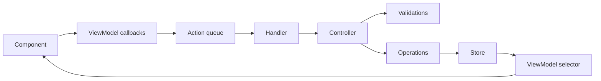

# App layer

The app layer is the renderer-side UI boundary for Vayeate Theme Studio. It turns user interaction and screen lifecycle into structured signals, routes those signals through a single mutation pipeline, and renders state back to the user. It does not own business rules or persistent state writes — those live in the domain layer.

## Purpose

- Present theme, template, catalog, and shell experiences as React UI.
- Translate clicks, keyboard input, and mount/unload lifecycle into typed **actions**.
- Orchestrate work by dispatching actions through **handlers** to **controllers**, which delegate validation and mutation to the domain layer.
- Expose read models and action callbacks to components through **viewmodels**, keeping components free of store subscriptions and business logic.

## Core abstractions

| Abstraction | Responsibility |
|-------------|----------------|
| **Component** | Render UI; handle DOM concerns (events, focus, propagation). Call viewmodel callbacks; do not mutate application state or enqueue actions directly. |
| **ViewModel** | Subscribe to domain stores; derive presentation state; build and dispatch actions; return named callbacks for the component. |
| **Action** | One typed signal per user or lifecycle interaction (`<CONTROL>_<ACTION>`). Payload carries user input or entity identifiers only — not values already in store state. |
| **Handler** | Route incoming actions to the correct controller. No business logic; may delegate across feature boundaries before reaching a leaf handler. |
| **Controller** | App-facing orchestration entry point for one action type. Runs validations, reads store snapshots, invokes domain operations. Does not call other controllers or write state directly. |

Shared infrastructure in this layer (action queue, background queue, and related plumbing) serializes UI-originated work and coordinates asynchronous follow-up without bypassing the domain mutation rules.

## Mutation flow

UI-originated signals — pointer/keyboard events and React lifecycle moments such as load, unload, and open — enter through viewmodels, not as ad hoc store updates.

Controllers may enqueue background work; operations perform all state changes. After the domain layer updates, viewmodels re-select from stores and components re-render.

## Boundaries

- **In scope:** presentation, action construction, routing, and orchestration entry points tied to UI.
- **Out of scope:** business rules, validation logic, state mutation, file I/O, and system integration — those belong in `src/domain/` and `src/gateway/`.
- **Components never subscribe to stores directly;** viewmodels own that relationship.

For full cross-layer conventions, mutation-flow exceptions, and naming rules, see the project root [AGENTS.md](../../AGENTS.md).
