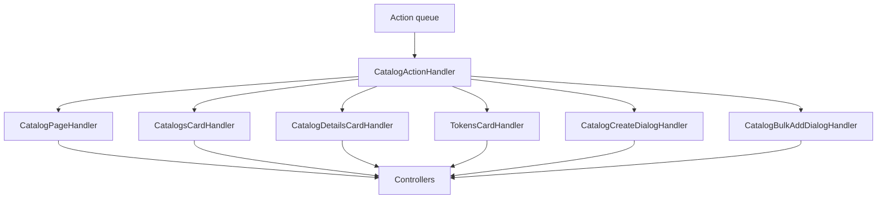

# Catalog UI domain

The catalog UI domain presents the **Catalogs** ribbon tab: browse catalog versions, inspect metadata and remote sources, and edit tokens for manual catalogs. It follows the standard app-layer mutation flow — components call viewmodel callbacks, actions enter the queue, handlers route to controllers, and domain operations persist changes.

## Layout

`CatalogsPage` composes the main grid and mounts overlay dialogs when their UI stores report open:

| Area | Folder | Role |
|------|--------|------|
| Page shell | `catalog-page/` | Tab entry, page load lifecycle, loading placeholders, dialog visibility |
| Catalog picker | `catalogs-card/` | Name/version selectors and create-catalog entry |
| Details panel | `catalog-details-card/` | Metadata, remote sources, lock/sync/revert/delete version |
| Tokens panel | `tokens-card/` | Theme/textmate token lists, semantic registry, search, bulk add |
| Create dialog | `create-dialog/` | New manual or remote catalog |
| Bulk add dialog | `bulk-add-dialog/` | Paste VS Code theme JSON to import tokens |
| Domain router | `actions/` | `CatalogActionHandler` unions feature actions and delegates to feature handlers |

Each feature folder typically owns `actions/` (types, guards, handler), `controllers/`, a PascalCase component, and `use-*-viewmodel.ts`.

## Action routing

`isCatalogAction` and `tryCoalesceCatalogAction` in `actions/catalog-action-type.ts` integrate with the global action queue. Text-field actions in details, tokens, and bulk-add coalesce to the latest value before handlers run.

## Selection and editing rules (presentation)

Viewmodels derive editability from catalog type, lock state, and whether the selected ref is the latest version for that catalog name. Manual catalogs on the latest version allow token and source edits; remote catalogs expose sync and source management on the latest version; older versions show revert instead of edit affordances.

Undo stack context switches when catalog selection changes (`SetSelectedCatalogController` and mutation controllers record catalog undo entries).

## Boundaries

- **In scope:** catalog tab UI, action construction, handler routing, controller orchestration for catalog interactions.
- **Out of scope:** catalog persistence, validation rules, and store shape — see `src/domain/catalog/` and `src/domain/state/ui/catalog-ui-store.ts`.
- Components do not subscribe to stores; viewmodels own `useStore` selectors and `useAppDispatch`.

For cross-layer conventions see the app layer [README](../README.md) and project [AGENTS.md](../../AGENTS.md).
