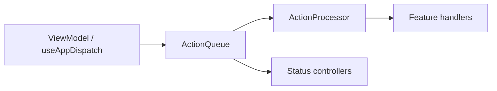

# Core infrastructure

The `core` folder holds shared app-layer plumbing that serializes UI-originated work and coordinates asynchronous follow-up. It sits between viewmodels (which enqueue actions) and feature handlers/controllers (which orchestrate domain work). It does not contain feature UI or business rules.

## Purpose

- **Action queue** — FIFO processing of typed `AppAction` signals from the renderer, with optional coalescing for high-frequency interactions.
- **Background queue** — Off-main-thread and deferred work (`main`, `worker`, `data_io`) with status observability and continuation chaining.
- **Bootstrap** — One-time app initialization invoked before the action pipeline is ready.
- **Undo controllers** — Shared entry points for undo, redo, and history navigation that close menus after a transition.

## Action queue

Viewmodels and `useAppDispatch` enqueue `AppAction` values. The queue merges compatible pending actions when a coalescing policy applies, then processes items serially through `ActionProcessor`, which routes each action to the correct feature handler.



Queue status updates are an documented exception in [AGENTS.md](../../AGENTS.md): the queue implementation may call its status controllers directly so observability state does not cycle back through the action pipeline.

## Background queue

Domain operations enqueue background work through `BackgroundQueuePort`. The facade dispatches to three queue implementations:

| Queue key | Implementation | Concurrency |
|-----------|----------------|-------------|
| `main` | `MainBackgroundQueue` (serial) | One job at a time |
| `worker` | `WorkerBackgroundQueue` (pooled) | Up to 16 parallel workers |
| `data_io` | `DataIoBackgroundQueue` (keyed) | Serial per key; reads pooled globally; writes exclusive per key |

Keyed `data_io` enqueues require `options.key` and `options.access` (`read` or `write`). Reads for the same key may run in parallel up to the read semaphore limit; writes for a key are strictly serial.

`BackgroundQueueResolver` implements continuation chaining: `onQueue` selects a target queue for follow-up work; `then` registers the callback invoked when the current job completes.

Background queue status controllers follow the same direct-call exception as the action queue.

## Organization

```
core/
  action-queue/       AppAction union, queue, coalescing, dispatch hook
  background-queue/ Queue implementations, resolver, status controllers
  bootstrap/        App bootstrap controller
  undo/             Undo, redo, history-go-to controllers
```

## Boundaries

- **In scope:** queuing, routing, coalescing, async scheduling, and queue observability adapters.
- **Out of scope:** action type definitions (feature `actions/`), handler routing tables (feature `actions/*-handler.ts`), validations, operations, and store writes.
- **Consumers:** viewmodels enqueue actions; operations enqueue background work via `BackgroundQueuePort`; handlers are registered in `ActionProcessor`.

For full mutation-flow rules and naming conventions, see [AGENTS.md](../../AGENTS.md) and [src/app/README.md](../README.md).
