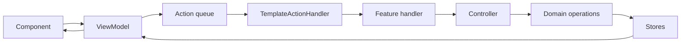

# Template app domain

The template app domain is the renderer-side UI boundary for authoring and managing theme templates. It covers template selection, version lifecycle, catalog linkage, token mappings, groups, and color/contrast variables.

## Purpose

- Present the Templates page and its editor cards as React UI.
- Translate user input and mount lifecycle into typed **actions** scoped to template editing.
- Route actions through feature **handlers** to **controllers**, which delegate validation and mutation to the domain layer.
- Expose read models and action callbacks to components through **viewmodels**.

## Feature layout

| Folder | Responsibility |
|--------|----------------|
| `actions/` | Root `TemplateActions` union, guard, coalescing, and `TemplateActionHandler` that delegates to feature handlers. |
| `template-page/` | Page shell, initial load, and aggregate loading state for the Templates screen. |
| `templates-card/` | Template name/version picker and entry point to create a new template. |
| `create-template-dialog/` | Modal flow to name and create a template. |
| `template-details-card/` | Version metadata actions such as lock and delete. |
| `template-catalogs-card/` | Catalog inclusion, version pins, and bulk catalog refresh for the selected template. |
| `groups-card/` | Template group list and add/remove controls. |
| `variables-card/` | Color and contrast variable list, search, and assignment UI. |
| `mappings-card/` | Token-to-variable mapping editor, including semantic variant rows. |

Each feature folder follows the standard app-layer shape: `actions/` (types + handler), `controllers/`, optional `use-*-viewmodel.ts`, and a PascalCase `*.tsx` component.

The mappings card supports transient multi-selection of real mappings across
groups and token types. Its bulk controls apply one group, color-variable, or
contrast-variable assignment to the complete selected set as a single undoable
template edit. Search, filters, collapsing, and virtualization do not change the
selection; changing template context clears it.

## Mutation flow

Template UI signals enter through viewmodels, join the shared action queue as `TemplateActions`, and fan out by feature guard in `TemplateActionHandler`.

High-frequency text inputs on groups, variables, mappings, and the create dialog use action coalescing (`tryCoalesceTemplateAction`) so the queue keeps only the latest pending value for the same control.

## Boundaries

- **In scope:** template editor presentation, action construction, routing, and orchestration entry points.
- **Out of scope:** template persistence rules, catalog loading, undo replay, and schema validation — those live in `src/domain/` and `src/gateway/`.
- **Components do not subscribe to stores directly;** viewmodels own store selectors and dispatch.

For cross-layer conventions and mutation-flow exceptions, see the project root [AGENTS.md](../../AGENTS.md) and [src/app/README.md](../README.md).
