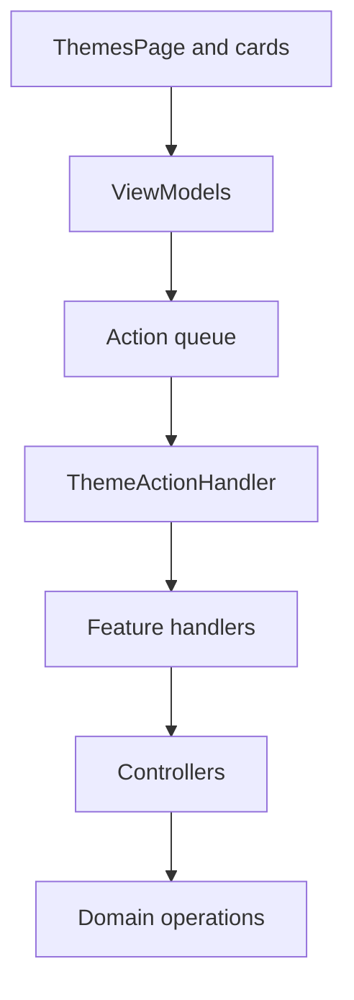

# Theme app domain

The theme app domain is the renderer-side UI for creating, selecting, editing, and previewing color themes in Vayeate Theme Studio. It follows the standard app-layer mutation pipeline: components call viewmodel callbacks, actions flow through handlers to controllers, and domain operations own state changes.

## Purpose

- List themes and versions, open the create-theme dialog, and load a selected theme into the editor.
- Edit theme metadata, palette clustering, hue adjustment, and color/contrast variable assignments.
- Show live editor previews resolved against the current theme and linked template.
- Record undo entries for palette and variable edits through shared theme undo helpers.

## Feature areas

| Folder | Role |
|--------|------|
| `actions/` | Root `ThemeActions` union, guard, coalescing, and `ThemeActionHandler` that delegates to feature handlers. |
| `theme-page/` | `ThemesPage` shell, page load lifecycle, and save-error chrome. |
| `themes-card/` | Theme name/version pickers and create button. |
| `create-theme-dialog/` | Modal flow to name and create a new theme. |
| `theme-details-card/` | Versioning, template link, preview token, and theme generation controls. |
| `theme-palette-card/` | Hue reference, cluster count, palette apply toggles, and color assignment from picker or eyedropper. |
| `theme-variables-card/` | Search, bulk selection, and per-variable color/contrast editing rows. |
| `editor-previews-card/` | Lazy-loaded tokenized editor previews with scope-resolved colors. |

Each feature folder typically contains:

- `actions/` — action types, guards, optional coalescers, and a handler routing to controllers.
- `controllers/` — one orchestration entry point per user interaction; validations then domain operations only.
- `use-*-viewmodel.ts` — store subscriptions, derived UI state, and named action callbacks.
- `*.tsx` — presentational components (PascalCase filenames).

## Action routing

Feature handlers (`ThemesCardHandler`, `ThemePaletteCardHandler`, etc.) are leaf routers for their action unions. `ThemeActionHandler` is the domain entry point registered with the app action queue.

## Boundaries

- **In scope:** theme editor presentation, action construction, handler routing, and controller orchestration for theme UI flows.
- **Out of scope:** theme persistence rules, palette math, scope resolution, and store mutation — those live under `src/domain/` and `src/gateway/`.
- **Shared UI:** eyedropper overlay and tri-state checkbox live under `src/app/common/`; theme cards dispatch actions that those flows complete via follow-up commit actions.

For cross-layer conventions see [AGENTS.md](../../../AGENTS.md) and the app layer overview in [src/app/README.md](../README.md).
