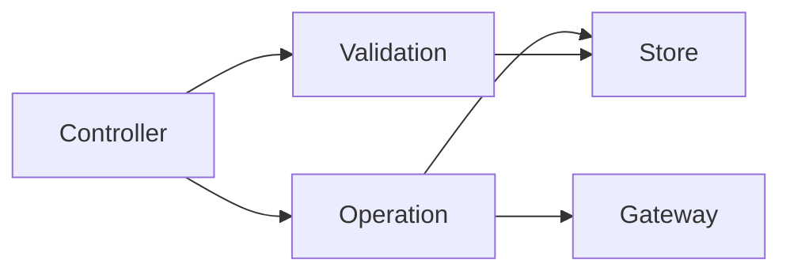

# Domain layer

The domain layer owns **business logic** and **application state** for Vayeate Theme Studio. Controllers in the app layer delegate here for validation and mutation; this layer does not render UI or talk to the platform directly.

## Purpose

- Encode rules for catalogs, themes, templates, undo, and related editor flows.
- Hold authoritative in-memory state in zustand stores.
- Apply changes atomically through operations after optional validation.
- Call gateways when persistence, IPC, or external conversion is required.

## Core abstractions

| Abstraction | Responsibility |
|-------------|----------------|
| **Operation** | Single atomic business change. Runs business logic, may call gateways/services, and **is the only place that mutates store state**. Invoked by controllers, not by UI or peer operations (narrow documented exceptions only). |
| **Validation** | Predicate or message-bearing check before a mutation. `test(...)` returns `boolean` or `ValidationResult`; never throws. Controllers run validations; viewmodels may reuse them for enable/disable and messaging. |
| **State (store)** | Domain-owned zustand vanilla stores with immer. Expose read snapshots and mutation methods. Controllers and validations **read**; operations **write** via store methods. |
| **Utils** | Pure helpers — transforms, resolvers, derivations. No store access for mutation, no I/O. |
| **Core** | Shared domain primitives and infrastructure helpers used across concepts (for example undo stack mechanics) without renderer or Electron logic. |

## Organization

Code is grouped **by domain first**. A business area may own its own `operations/`, `validations/`, `state/`, and helpers. UI-facing flow state lives under `ui/` when separated from business entities. Legacy shared concept folders (`operations/`, `validations/`, `state/`, `utils/`, `core/`) remain for cross-cutting or not-yet-migrated concerns.

Prefer colocating logic with the concept it serves over central lists of files; the layout reflects **what** is being modeled, not a rigid layer taxonomy.

## Mutation rules

- **Business rules live here** — not in components, handlers, gateways, or Electron.
- **State mutations only in operations** — via store mutation methods after validation when needed.
- **No business rules in gateways** — operations decide outcomes; gateways convert and persist.

Validations and controllers may read store snapshots to decide whether work may proceed; only operations apply updates.

## Boundaries

- **In scope:** business rules, validations, state shape, undo/history behavior, and orchestration of I/O through gateways.
- **Out of scope:** React presentation, action routing, IPC wiring, and raw platform APIs — those belong in `src/app/` and `src/gateway/`.
- **Models** (`src/model/`) define domain types and zod schemas; domain code consumes them but does not replace them.

For full cross-layer conventions, mutation-flow exceptions, and naming rules, see the project root [AGENTS.md](../../AGENTS.md).
