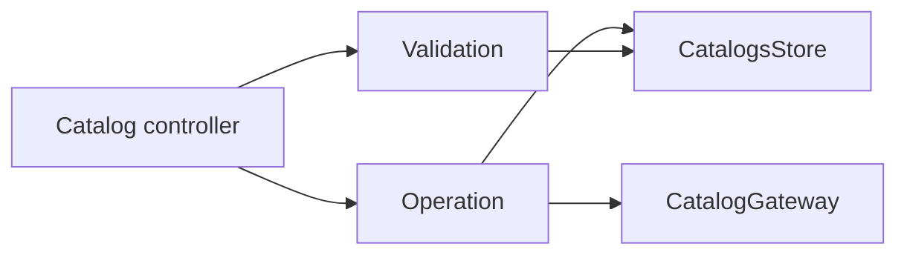

# Catalog domain

Business rules, validations, and in-memory state for **catalog** artifacts (token registries with optional remote sources). Controllers in `src/app/catalog/` delegate here; this folder does not render UI or call Electron directly.

## Layout

| Location | Role |
|----------|------|
| `state/` | `CatalogsState` shape, read helpers, and `CatalogsStore` — the authoritative map of catalog refs and loaded bodies |
| `operations/` | Lifecycle mutations: list refs, create, and delete catalogs (with background I/O) |
| `validations/` | Predicates and message-bearing checks before catalog create/edit actions |

Catalog **detail** operations (tokens, sources, sync, lock, persist) remain under legacy `src/domain/operations/catalog-operations/` until fully migrated. UI flow state (selection, page load, dialog drafts) lives in `src/domain/state/ui/catalog-ui-store.ts`.

## State model

Catalogs are indexed **name → version → `{ isLoaded, catalog }`**. A ref may exist before its body is loaded from disk; helpers in `catalogs-store.ts` resolve the selected ref, enumerate refs, or collect all loaded catalogs for validations and undo.

## Mutation flow

Validations and controllers read store snapshots; only operations write via `CatalogsStore` mutation methods (`updateCatalogRefs`, `upsertCatalogs`).

## Key operations

| Operation | Responsibility |
|-----------|------------------|
| `LoadCatalogRefsOperation` | Lists catalog refs from disk and seeds the store map |
| `CreateCatalogOperation` | Creates a `1.0.0` manual catalog in memory and schedules save |
| `DeleteCatalogOperation` | Schedules deletion of a catalog file on disk |

## Validations

| Validation | Returns | Use |
|------------|---------|-----|
| `ValidateCatalogNameIsValid` | `ValidationResult` | Alphanumeric and hyphen name rules |
| `ValidateCatalogNameIsUnique` | `ValidationResult` | Name not already present in the store |
| `ValidateSyncCatalog` | type predicate | Catalog is remote and eligible for sync |
| `ValidateCanLockCatalog` | `boolean` | Manual, unlocked catalog |
| `ValidateCanUpdateCatalogSource` | `boolean` | Source index in range |
| `ValidateCanBulkAddTokens` | `boolean` | Catalog loaded and bulk text non-empty |

Models (`src/model/schema/catalog.ts`) define the `Catalog` entity; this domain consumes those types.

For cross-layer conventions see [domain README](../README.md) and project [AGENTS.md](../../AGENTS.md).
