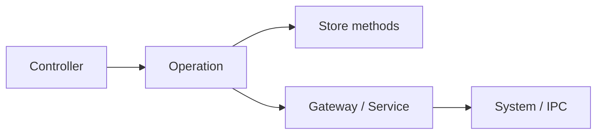

# Operations

Operations are the **only** place in the domain layer that **mutates store state**. Each operation performs one atomic business change: it may read inputs, call gateways or services, and apply updates through store methods. Controllers invoke operations after optional validation; UI, handlers, and peer operations do not call them directly (narrow documented exceptions only).

## Contract

| Rule | Detail |
|------|--------|
| **Naming** | Class suffix `Operation`; file `kebab-case-operation.ts`. |
| **Entry point** | One public `execute(...)` with explicit inputs. Private helpers are allowed when they support the same atomic change. |
| **DI** | `@singleton()` from tsyringe; inject gateways, services, and stores as concrete types. |
| **Callers** | Controllers only, except documented queue adapters and theme/undo helper pairs (see project [AGENTS.md](../../../AGENTS.md)). |
| **Scope** | One logical change on one primary entity; batching is OK when inherently a single user action. |

## Organization

Operations are grouped **by domain and feature**, mirroring catalogs, themes, templates, undo, app shell, and shared infrastructure:

| Folder | Responsibility |
|--------|----------------|
| `action-queue/` | Action-queue processing status updates (queue implementation exception). |
| `app-operations/` | App config, menus, tooltips, tabs, color scheme, window service lifecycle. |
| `background-queue/` | Background I/O queue adapter and status; `immediateContinuation` for cache hits. |
| `catalog-operations/` | Catalog load/save/sync, sources, tokens, bulk-add UI state. |
| `create-dialog/` | Catalog create dialog open/close and form state. |
| `delete/` | Catalog ref loading, selection, and display helpers shared by delete flows. |
| `eyedropper-operations/` | Eyedropper overlay open/close, pointer, zoom, viewport. |
| `template-operations/` | Template CRUD, groups, variables, semantic mappings, contrast UI. |
| `theme-operations/` | Theme CRUD, color variables, palette cluster/hue/assign, previews, pickers. |
| `undo-operations/` | Undo/redo stack, record/apply/replay, lifecycle undo, persistence port. |
| `window-operations/` | Window drag, size, position, display state, dev tools. |

Prefer colocating an operation with the concept it serves rather than central registries. Shared legacy paths under this root remain valid for cross-cutting or not-yet-migrated flows.

## Mutation flow

Operations **write** state; validations and controllers **read** snapshots to decide whether work may proceed.

## Related layers

- **Validations** (`src/domain/validations/`) — pre-mutation checks; never mutate state.
- **State** (`src/domain/**/state/`) — zustand stores; mutation methods called only from operations.
- **Gateways** (`src/gateway/`) — persistence and conversion; no business rules.

For full cross-layer conventions, operation-to-operation exceptions, and architecture tests, see [AGENTS.md](../../../AGENTS.md) and [src/domain/README.md](../README.md).
